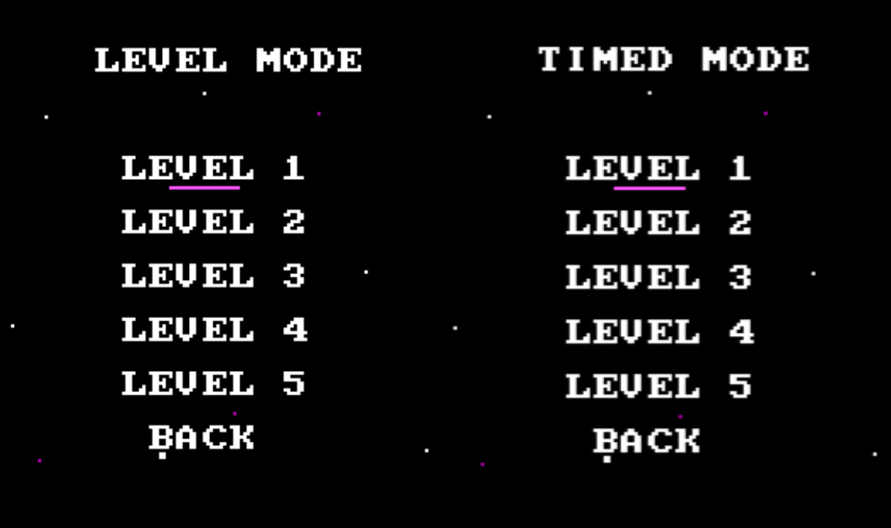
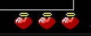
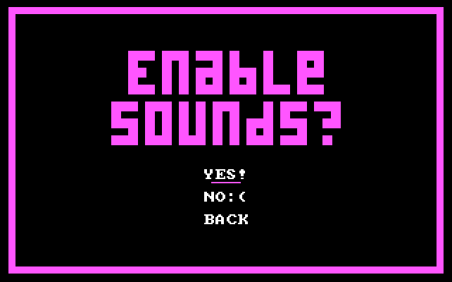
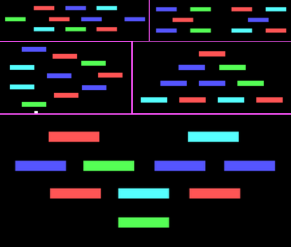

<h1  align="center"  id="title">Block Buster</h1>

Inspired by Atari Halls' Breakout in 1976, Block Buster is an arcade-style 
  brick breaker game that reimagines the classic gameplay for modern platforms.

 

  
<strong>Table of Contents</strong>

  <ol>
    <li>
      <a href="#game-demo">Game Demo</a>
    </li>
    <li><a href="#game-features">Game Features</a></li>
    <li><a href="#about-project">About the Project</a>
		<ul>
        <li><a href="#built-with">Built With</a></li>
      </ul>
   </li>
    <li><a href="#getting-started">Getting Started</a>
		<ul>
        <li><a href="#installation">Installation</a></li>
      </ul>
   </li>
    <li><a href="#developers">Developers</a></li>
  </ol>

 
<h2 id="game-demo">🕹️ Game Demo</h2>

<h2 id="game-features">🎮 Game Features</h2>

<h4>
<strong>
<ol>
<li>Progressive difficulty [Level 1-5]
<li>Multiple game modes [Level Mode and Timed Mode] 
	 

 <li>Limited lives [Level Mode]
	 

 <li>Timer and score [Timed Mode] 
	

	

<li>Enable and disable 'beep' SFX
	

<li>Name display
	

	

<li>Different brick layout for each level
	

</strong>
</h4>
  
<h2 id="about-project">💡 About the Project</h2>

The developers created 'Block Buster', which is a Breakout-inspired arcade game made in 
  x86 assembly language and assembled using Turbo Assembler (TASM), in fulfillment of our course requirement 
  in Computer Architecture and Assembly Language Programming.

<h3 id="built-with">Built Using</h3>
<ul>
	<li> x86 Assembly Language
	<li> Turbo Assembler
	<li> DOSBox Emulator
	<li> Notepad++
</ul>

<h2 id="getting-started">💻 Getting Started</h2>
<h3 id="installation">Installation</h3>
<h5>1. Install <a href="https://www.dosbox.com/download.php?main=1">DOSBox Emulator</a></h5>
<h5>2. Download required <a href="https://drive.google.com/drive/folders/1f5AbF74QyH7I8SWR5kqSSVFG2vfnAxLt?usp=sharing">TASM tools</a></h5>
<h5>3. Clone the repository</h5>

     git clone https://github.com/jhamped/blockbuster-assembly.git

<h5>4. Run DOSBox, and change the directory to the repository</h5>
<h5>5. Assemble the game 
<i>(the required TASM tools should be in the same directory as the repo)</i></h5>

    tasm bbuster.asm
    tlink bbuster.obj
<h5>6. Run the game and enjoy!</h5>

    bbuster.exe

<h2 id="developers">👥 Developers</h2>
<h4>------ BSCS 2-1 - Group 4  ------</h4>
<ul>
	<li> Aguinaldo, Samantha S.
	<li> Bautista, Anna Kathlyn A.
	<li> Chaves, Samantha D.
	<li> De Roxas, Carnation Jhulia I.
	<li> Enriquez, Sybil Mitch S.
	<li> Fallaria, Immaculate L.
	<li> Pantoja, Rhayzel S.
	<li> Pineda, Ernest Michael B.
</ul>
